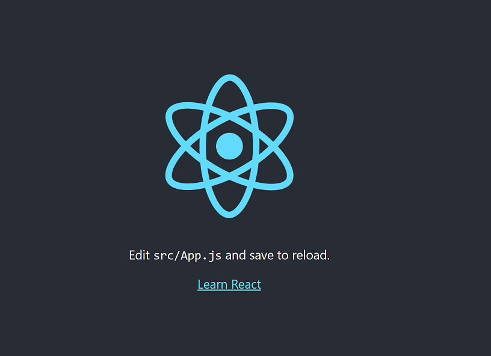

# sample-react-app

- sample-react-app 

    []()

- [Create React App](https://reactjs.org/docs/create-a-new-react-app.html#create-react-app)  

    Create React App is a comfortable environment for learning React, and is the best way to start building a new single-page application in React.

    It sets up your development environment so that you can use the latest JavaScript features, provides a nice developer experience, and optimizes your app for production. You’ll need to have Node >= 14.0.0 and npm >= 5.6 on your machine. To create a project, run:

    ```shell
    npx create-react-app my-app
    cd my-app
    npm start
    ```

    Note：  
    npx on the first line is not a typo — it’s a package runner tool that comes with npm 5.2+.

- Depoly React App
    ```shell
    npm run build
    ```
    Note:  after that we can deploy build folder to server.
    ```
    cqiao@DESKTOP-XIAOXIN:~/app$ ls -l
    total 1212
    -rw-r--r--   1 cqiao cqiao    3359 Jul 13 23:11 README.md
    drwxr-xr-x   3 cqiao cqiao    4096 Jul 13 23:19 build
    drwxr-xr-x 801 cqiao cqiao   36864 Jul 13 23:18 node_modules
    -rw-r--r--   1 cqiao cqiao 1177660 Jul 13 23:11 package-lock.json
    -rw-r--r--   1 cqiao cqiao     806 Jul 13 23:11 package.json
    drwxr-xr-x   2 cqiao cqiao    4096 Jul 13 23:11 public
    drwxr-xr-x   2 cqiao cqiao    4096 Jul 13 23:11 src
    cqiao@DESKTOP-XIAOXIN:~/app$ tree build/
    build/
    ├── asset-manifest.json
    ├── favicon.ico
    ├── index.html
    ├── logo192.png
    ├── logo512.png
    ├── manifest.json
    ├── robots.txt
    └── static
        ├── css
        │   ├── main.073c9b0a.css
        │   └── main.073c9b0a.css.map
        ├── js
        │   ├── 787.c1112931.chunk.js
        │   ├── 787.c1112931.chunk.js.map
        │   ├── main.2a743ecd.js
        │   ├── main.2a743ecd.js.LICENSE.txt
        │   └── main.2a743ecd.js.map
        └── media
            └── logo.6ce24c58023cc2f8fd88fe9d219db6c6.svg

    4 directories, 15 files
    cqiao@DESKTOP-XIAOXIN:~/app$
    ```